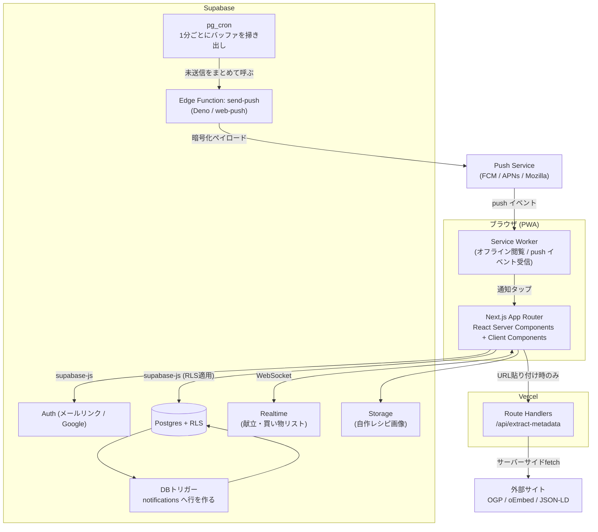
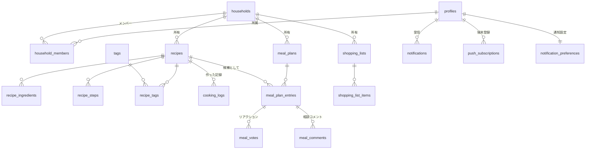
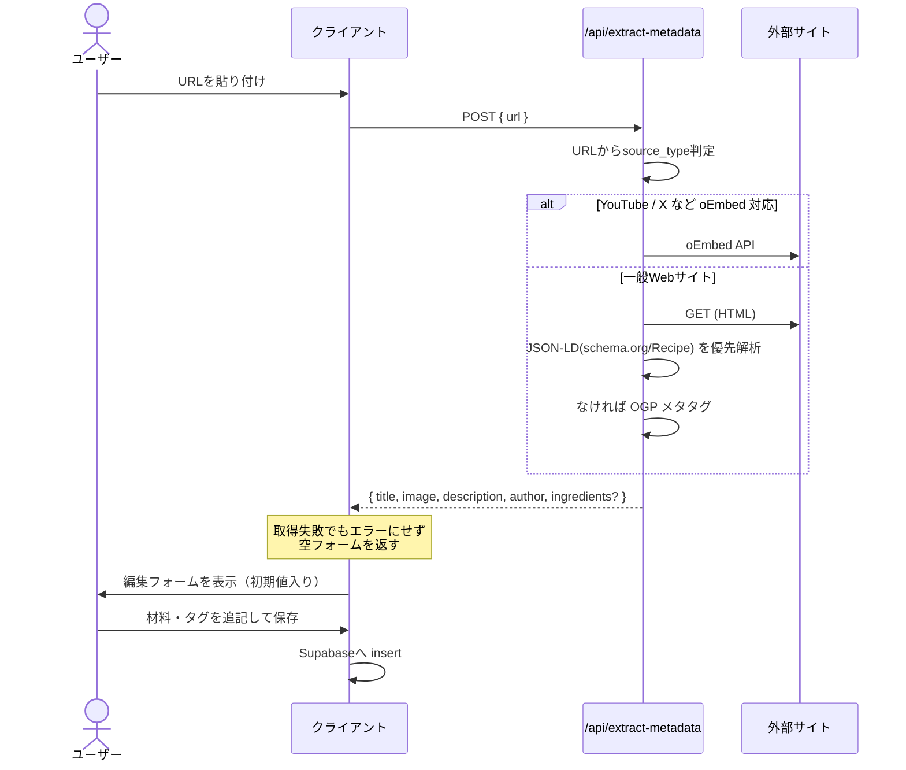
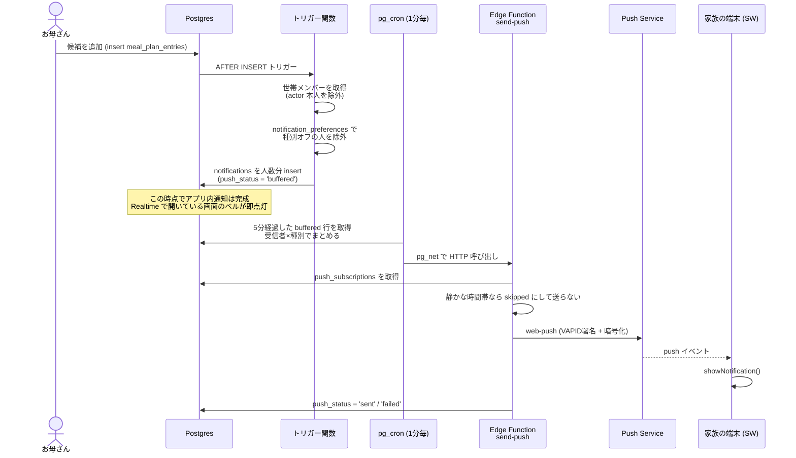

# 家族レシピ共有アプリ 設計書

## 1. 概要

インターネット・動画・SNS・自作のレシピを一元的に保存し、家族で共有・献立相談・買い物リスト化まで行うPWA。

| 項目 | 決定 |
| --- | --- |
| 形態 | スマホファーストのWebアプリ（PWA） |
| フロントエンド | Next.js 15 (App Router) + TypeScript + Tailwind CSS + shadcn/ui |
| バックエンド | Supabase (Postgres / Auth / Storage / Realtime) |
| 取り込み | URLからメタ情報（OGP・oEmbed）を自動取得、材料は手入力 |
| ホスティング | Vercel |
| 共有単位 | 「世帯（household）」に属するメンバー間で全データを共有 |
| 通知 | Web Push（VAPID）＋ アプリ内通知センターの二層構成 |

### 1.1 コアコンセプト

```
レシピを貯める  →  週の献立を家族で相談して決める  →  確定した献立から買い物リストを自動生成
```

この3つが一本の線でつながっていることがこのアプリの価値。単なるブックマーク集にしない。

---

## 2. 機能要件

### 2.1 レシピ保存

| 種別 | 保存方法 | 自動取得できるもの |
| --- | --- | --- |
| Webレシピ（クックパッド、Nadia等） | URLを貼る | OGP: タイトル / 画像 / 説明 / サイト名。JSON-LD (`schema.org/Recipe`) があれば材料・手順も取得 |
| YouTube / TikTok | URLを貼る | oEmbed: タイトル / サムネイル / 投稿者。詳細ページで埋め込み再生 |
| X (Twitter) | URLを貼る | oEmbed: 本文テキスト / 投稿者。画像は取得できないことがある |
| Instagram | URLを貼る | **取得は不安定**（ログイン必須のため）。URL・投稿者のみ保存し、タイトルと画像は手入力にフォールバック |
| 自作レシピ | フォーム入力 | 材料・手順・写真アップロード |

**重要な設計判断**: SNSのメタ取得は失敗する前提で作る。取得に失敗しても「タイトルだけ入れて保存」が必ずできること。取得結果はあくまで**フォームの初期値**であり、保存前に必ずユーザーが編集できる画面を挟む。

### 2.2 レシピ一覧・検索
- カードグリッド表示（サムネイル + タイトル + ソースアイコン）
- 検索: タイトル・材料名の部分一致
- 絞り込み: タグ（和食/時短/子ども向け等）、ソース種別、登録者、お気に入り
- ソート: 追加順 / 作った回数 / 最後に作った日

### 2.3 献立ボード（家族で相談する中核機能）
- 1週間 × 各日の「朝 / 昼 / 夕」スロットを表形式で表示
- 1スロットに**複数の候補**を積める（ここが相談機能の肝）
- 各候補に家族が **👍 食べたい / 🙅 今週はパス** のリアクションとコメントを付けられる
- Supabase Realtime で全員の画面に即時反映
- 「これにする」で候補を**確定**にし、他候補は自動でアーカイブ
- 確定済みスロットの材料をまとめて買い物リストに送る

### 2.4 買い物リスト
- 献立の確定分から材料を一括生成（同じ材料は単位を揃えて合算）
- レシピ詳細から材料を個別に追加も可能
- 売り場カテゴリ（野菜 / 肉魚 / 乳製品 / 調味料 / その他）で自動グルーピング
- 家族全員でリアルタイム共有し、買った人がチェック → 誰がチェックしたか表示
- 「家にある」材料はチェックを外して除外できる

### 2.5 世帯・メンバー管理
- 世帯を作成 → 招待コード（またはリンク）で家族を招待
- ロール: `owner` / `member`（当面 owner のみ世帯削除・メンバー除名が可能）

### 2.6 通知

家族の誰かがアクションを起こしたとき、他のメンバーに通知する。**献立の相談は非同期で進む**（各自が空き時間に見て意見を出す）ため、通知がないと相談機能が機能しない。

| # | イベント | 通知先 | 文面の例 |
| --- | --- | --- | --- |
| N1 | 献立に候補が追加された | 本人以外の全員 | 「お母さんが 7/30(木)の夕食 に *カレー* を提案しました」 |
| N2 | 自分が提案した候補に「食べたい」が付いた | 候補の提案者 | 「お父さんが *カレー* に👍しました」 |
| N3 | 候補にコメントが付いた | 提案者＋そのスレッドの発言者 | 「息子: 明日でもいい？」 |
| N4 | 献立が確定した | 本人以外の全員 | 「7/30(木)の夕食は *カレー* に決まりました」 |
| N5 | 未投票のまま候補が残っている | まだ投票していない人 | 「今週の献立に3件の候補が待っています」（1日1回のリマインドまで） |
| N6 | 買い物リストが作成された | 本人以外の全員 | 「今週の買い物リスト（12品）ができました」 |
| N7 | 買い物リストが全部チェックされた | 本人以外の全員 | 「お父さんが買い物を完了しました」 |
| N8 | 新しいメンバーが世帯に参加した | 既存メンバー全員 | 「妹さんが参加しました」 |

**共通ルール**
- **自分の操作は自分に通知しない**（`actor_id = 受信者` を必ず除外）
- 通知はタップで該当画面（スロット詳細・買い物リスト等）に直接遷移する
- 種別ごとにオン/オフを個人設定できる。既定は N1〜N4・N6 がオン、N5・N7 はオフ
- 「静かな時間帯」（既定 22:00〜7:00）は Push を送らず、アプリ内通知にのみ積む

**まとめ配信（重要）**
献立ボードは短時間に何件も操作が発生する（候補を3つまとめて追加する等）。1操作1通知だと家族の端末が鳴り続けて、真っ先に通知をオフにされる。**同一ユーザー・同一種別の通知は5分間バッファし、まとめて1通に集約**する。

> 「お母さんが今週の献立に3件の候補を追加しました」

---

## 3. アーキテクチャ



### 3.1 なぜメタ取得だけサーバー経由か
ブラウザから外部サイトを直接 fetch すると CORS で失敗する。かつ User-Agent を偽装できない。Route Handler（サーバー側）で取得することで CORS を回避し、レスポンスをキャッシュできる。

### 3.2 データアクセス方針
- **読み取り・書き込みは基本すべてクライアントから supabase-js で直接**行い、Postgres の RLS を唯一の権限境界とする。API層を薄く保ち、Realtime の恩恵をそのまま受けられる。
- 例外はメタ取得のみ（外部通信が必要なため）。

---

## 4. データモデル



### 4.1 テーブル定義

#### profiles
`auth.users` の拡張。

| カラム | 型 | 備考 |
| --- | --- | --- |
| id | uuid PK | `auth.users.id` を参照 |
| display_name | text | 表示名 |
| avatar_url | text | |
| created_at | timestamptz | |

#### households / household_members

| households | 型 |
| --- | --- |
| id | uuid PK |
| name | text（例: 「山田家」）|
| invite_code | text UNIQUE（8文字のランダム英数字）|
| created_by | uuid |
| created_at | timestamptz |

| household_members | 型 |
| --- | --- |
| household_id | uuid PK(複合) |
| user_id | uuid PK(複合) |
| role | text `owner` / `member` |
| joined_at | timestamptz |

#### recipes

| カラム | 型 | 備考 |
| --- | --- | --- |
| id | uuid PK | |
| household_id | uuid FK | 共有単位 |
| title | text NOT NULL | 唯一の必須項目 |
| source_type | text | `web` / `youtube` / `tiktok` / `x` / `instagram` / `original` |
| source_url | text | 自作の場合 null |
| source_site_name | text | 「クックパッド」等 |
| source_author | text | 投稿者名 |
| image_url | text | OGP画像 or Storage のURL |
| description | text | |
| servings | text | 「2人分」など単位が多様なので text |
| cook_time_minutes | int | |
| memo | text | 家族用メモ（「息子が好き」「塩は半分で」等）|
| is_favorite | boolean | |
| created_by | uuid | |
| created_at / updated_at | timestamptz | |
| raw_metadata | jsonb | 取得した生データを保存（後から再解析できるように）|

**インデックス**: `(household_id, created_at desc)`、タイトル・材料の全文検索用に `pg_trgm` の GIN インデックス。

#### recipe_ingredients

| カラム | 型 | 備考 |
| --- | --- | --- |
| id | uuid PK | |
| recipe_id | uuid FK CASCADE | |
| group_name | text | 「タレ」「衣」等のグループ見出し。null可 |
| raw_text | text NOT NULL | 「玉ねぎ 1/2個」入力そのまま。**これが正**|
| name | text | 正規化後の材料名「玉ねぎ」 |
| quantity | numeric | 0.5 |
| unit | text | 「個」 |
| sort_order | int | |

**設計判断**: `raw_text` を必ず保持する。分量パースは失敗しうるので、表示は常に `raw_text`、買い物リストの合算にだけ `name/quantity/unit` を使う。パース失敗時は合算せず個別行として並べる。

#### recipe_steps

| カラム | 型 |
| --- | --- |
| id / recipe_id / step_no / body / image_url |

#### tags / recipe_tags
`tags(id, household_id, name, color)` — 世帯ごとに自由に作れるタグ。

#### cooking_logs

| カラム | 型 | 備考 |
| --- | --- | --- |
| id / recipe_id / cooked_on (date) / cooked_by / rating (1-5) / note | | 「最近作ってない料理」を出すのに使う |

#### meal_plans / meal_plan_entries

| meal_plans | 型 | 備考 |
| --- | --- | --- |
| id | uuid PK | |
| household_id | uuid FK | |
| week_start_date | date | 月曜日。`(household_id, week_start_date)` で UNIQUE |

| meal_plan_entries | 型 | 備考 |
| --- | --- | --- |
| id | uuid PK | |
| meal_plan_id | uuid FK | |
| date | date | |
| meal_slot | text | `breakfast` / `lunch` / `dinner` |
| recipe_id | uuid FK nullable | |
| free_text | text | レシピ未登録の「外食」「残り物」等 |
| status | text | `candidate`（候補） / `confirmed`（確定） / `archived` |
| added_by | uuid | 誰が提案したか |
| sort_order | int | |

#### meal_votes / meal_comments

| meal_votes | 型 |
| --- | --- |
| entry_id + user_id | PK（複合、1人1票）|
| value | text `want`（食べたい） / `pass`（今週はパス）|

| meal_comments | 型 |
| --- | --- |
| id / entry_id / user_id / body / created_at |

#### shopping_lists / shopping_list_items

| shopping_lists | 型 | 備考 |
| --- | --- | --- |
| id / household_id | | |
| name | text | 「7/29〜8/4の買い物」 |
| source_meal_plan_id | uuid nullable | 献立から生成した場合 |
| status | text | `active` / `done` |

| shopping_list_items | 型 | 備考 |
| --- | --- | --- |
| id / list_id | | |
| name | text | 「玉ねぎ」 |
| quantity / unit | numeric / text | 合算後の値。パース不能なら null |
| display_text | text | 「玉ねぎ 1.5個」など画面表示用 |
| category | text | `vegetable` / `meat_fish` / `dairy` / `seasoning` / `other` |
| is_checked | boolean | |
| checked_by / checked_at | uuid / timestamptz | |
| source_recipe_ids | uuid[] | どのレシピ由来か（タップで確認できる）|
| added_by | uuid | |

#### ingredient_aliases（材料名正規化マスタ）

| カラム | 型 | 備考 |
| --- | --- | --- |
| alias | text PK | 「たまねぎ」「玉葱」「タマネギ」 |
| canonical_name | text | 「玉ねぎ」 |
| category | text | `vegetable` |

システム共通の初期データを数百件投入しておき、ヒットしない材料は `other` カテゴリで素通しする。

#### notifications（通知の実体・アプリ内通知センターも兼ねる）

| カラム | 型 | 備考 |
| --- | --- | --- |
| id | uuid PK | |
| household_id | uuid FK | RLS用 |
| recipient_id | uuid FK | 受信者。**1イベント×受信者数だけ行を作る** |
| actor_id | uuid FK | 操作した人。`recipient_id` と同じ行は作らない |
| type | text | `meal_candidate_added` / `meal_vote` / `meal_comment` / `meal_confirmed` / `plan_reminder` / `shopping_list_created` / `shopping_done` / `member_joined` |
| title / body | text | 生成済みの文面 |
| link_path | text | `/plan/2026-07-30/dinner` — タップ先 |
| entity_type / entity_id | text / uuid | 集約とバッジ表示に使う |
| read_at | timestamptz | null なら未読 |
| push_status | text | `pending` / `buffered` / `sent` / `skipped` / `failed` |
| push_sent_at | timestamptz | |
| created_at | timestamptz | |

**インデックス**: `(recipient_id, created_at desc)`、送信ワーカー用に `(push_status, created_at) where push_status in ('pending','buffered')` の部分インデックス。

#### push_subscriptions（端末ごとの購読情報）

| カラム | 型 | 備考 |
| --- | --- | --- |
| id | uuid PK | |
| user_id | uuid FK | |
| endpoint | text UNIQUE | Push Service のURL |
| p256dh / auth | text | 暗号化キー（`PushSubscription.toJSON()` の値） |
| user_agent | text | 「iPhoneのSafari」等、設定画面での識別用 |
| last_success_at | timestamptz | |
| failure_count | int | 410/404 が返ったら即削除、それ以外は3回で無効化 |
| created_at | timestamptz | |

1ユーザーが複数端末（スマホ・PC）を持つ前提。**全端末に送る**。

#### notification_preferences

| カラム | 型 | 備考 |
| --- | --- | --- |
| user_id | uuid PK | |
| enabled_types | text[] | オンにしている通知種別 |
| quiet_hours_start / _end | time | 既定 22:00 / 07:00 |
| timezone | text | 既定 `Asia/Tokyo` |

---

## 5. RLS（行レベルセキュリティ）設計

全テーブルで RLS を有効化し、**「自分が所属する世帯のデータのみ」**という一貫した規則にする。

```sql
-- 所属世帯の判定を関数化（再帰的なポリシー評価を避けるため SECURITY DEFINER）
create or replace function public.my_household_ids()
returns setof uuid
language sql stable security definer set search_path = public
as $$
  select household_id from household_members where user_id = auth.uid()
$$;

-- recipes の例
alter table recipes enable row level security;

create policy "select_own_household" on recipes for select
  using (household_id in (select my_household_ids()));

create policy "insert_own_household" on recipes for insert
  with check (household_id in (select my_household_ids()) and created_by = auth.uid());

create policy "update_own_household" on recipes for update
  using (household_id in (select my_household_ids()));

create policy "delete_own_household" on recipes for delete
  using (household_id in (select my_household_ids()));
```

子テーブル（`recipe_ingredients` 等）は親を辿って判定する:

```sql
create policy "select_via_recipe" on recipe_ingredients for select
  using (exists (
    select 1 from recipes r
    where r.id = recipe_id and r.household_id in (select my_household_ids())
  ));
```

**注意点**:
- `household_members` 自身のポリシーは再帰しやすい。`user_id = auth.uid()` で自分の行を、それ以外は `SECURITY DEFINER` 関数経由で判定する。
- 招待コードでの参加は、コード検証と行挿入を行う RPC（`join_household(code text)`）を `SECURITY DEFINER` で用意する。`households` テーブルを未参加ユーザーに直接 SELECT させないため。
- Storage も同様にバケットポリシーで世帯IDをパス（`recipes/{household_id}/{recipe_id}/xxx.jpg`）に含めて制御する。

---

## 6. 画面設計

### 6.1 画面一覧とルーティング

| ルート | 画面 | 内容 |
| --- | --- | --- |
| `/login` | ログイン | メールマジックリンク / Google |
| `/onboarding` | 世帯作成・参加 | 新規作成 or 招待コード入力 |
| `/` | レシピ一覧 | カードグリッド、検索、フィルタ |
| `/recipes/new` | レシピ追加 | URL貼り付け or 手入力 |
| `/recipes/[id]` | レシピ詳細 | 材料・手順・埋め込み・買い物リスト追加 |
| `/recipes/[id]/edit` | レシピ編集 | |
| `/plan` | 献立ボード | 今週の週表示。前後の週へ移動 |
| `/plan/[date]/[slot]` | スロット詳細 | 候補一覧・投票・コメント（モバイルではボトムシート）|
| `/shopping` | 買い物リスト | チェックリスト |
| `/settings` | 設定 | 世帯メンバー、招待コード、プロフィール |
| `/settings/notifications` | 通知設定 | 種別ごとのオン/オフ、静かな時間帯、登録端末の一覧と解除 |
| `/notifications` | 通知センター | 受信した通知の一覧。タップで該当画面へ。未読は背景色で区別 |

下部タブナビゲーション: **レシピ / 献立 / 買い物 / 設定** の4つ。
通知はヘッダー右上のベルアイコン（未読件数バッジ付き）から開く。バッジは `notifications` の Realtime 購読でリアルタイムに更新する。

### 6.2 レシピ追加フロー



**タイムアウトは5秒**。それを超えたら諦めて空フォームを出す。ユーザーを待たせない方が体験がいい。

### 6.3 献立ボード UI

```
┌─────────────────────────────────────┐
│  ‹  7/29(水) 〜 8/4(火)  ›     [+]  │
├──────┬──────────────────────────────┤
│ 7/29 │ 夕 ✅ 鶏の照り焼き            │
│  水  │    朝 — / 昼 —               │
├──────┼──────────────────────────────┤
│ 7/30 │ 夕 🗳 候補2件                 │
│  木  │    ・カレー      👍2 💬1     │
│      │    ・パスタ      👍1 🙅1     │
├──────┼──────────────────────────────┤
│ 7/31 │ 夕 ＋ 候補を追加              │
└──────┴──────────────────────────────┘
   [ 確定した献立から買い物リストを作る ]
```

- モバイルでは日付ごとの縦積みリスト、PCでは7列の週グリッドに切り替える
- 空きスロットの `＋` から、レシピ検索モーダルまたはフリーテキストで候補を追加
- 各候補カードに投票ボタンとコメント数を表示、タップで詳細シート
- Supabase Realtime を `meal_plan_entries` / `meal_votes` / `meal_comments` に張り、家族の操作が数百ms で反映される

### 6.4 買い物リスト生成ロジック

```
確定した meal_plan_entries
  → 各 recipe の recipe_ingredients を収集
  → ingredient_aliases で name を正規化
  → (canonical_name, unit) が一致するものを quantity 合算
  → パース不能（quantity が null）なものは合算せず個別行
  → category でグルーピングして shopping_list_items へ一括 insert
```

生成時は**プレビュー画面を挟む**。「合算結果はこうなります、家にあるものは外してください」という確認を経てから確定させる。自動生成をそのまま押し付けると、調味料だらけのリストになって使われなくなる。

---

## 7. 通知設計

### 7.1 二層構成にする理由

**Push 通知だけに頼らない。** 理由は iOS の制約：

- iOS で Web Push が使えるのは **Safari 16.4 以降 かつ「ホーム画面に追加」して起動した場合のみ**。ブラウザのタブで開いている限り一切通知は届かない
- 通知許可のダイアログも、ホーム画面から起動したPWA内でユーザー操作を起点にしないと出せない
- Android Chrome / デスクトップは通常のPWAで問題なく動作する

家族のうち1人でも iPhone をブラウザで使っていれば、その人には Push が届かない。そこで:

| 層 | 実体 | 役割 |
| --- | --- | --- |
| **アプリ内通知センター** | `notifications` テーブル + ヘッダーのベルアイコン | **必ず動く土台**。未読バッジ、履歴、既読管理 |
| **Web Push** | Service Worker + VAPID | 対応端末に**リアルタイムで届ける上乗せ** |

通知の生成（`notifications` への行追加）と配信（Push送信）を分離することで、Push が使えない端末でもアプリを開けば必ず気付ける。

### 7.2 生成フロー



**設計判断: なぜ即時送信せず1分ポーリングか**
トリガーから直接 Edge Function を叩くと、まとめ配信ができず、外部通信の失敗がユーザーの書き込みトランザクションに影響する。「通知行を作る」ことだけをトランザクション内で保証し、配信は非同期のワーカーに任せる。結果として最大1分の遅延が出るが、献立の相談という用途では問題にならない。

### 7.3 まとめ配信のルール

`buffered` の通知を掃き出すとき、`(recipient_id, actor_id, type, entity_id)` でグルーピングする。

| 件数 | 送る文面 |
| --- | --- |
| 1件 | 「お母さんが 7/30(木)の夕食 に カレー を提案しました」 |
| 2件以上 | 「お母さんが今週の献立に3件の候補を追加しました」 |

Push のペイロードに `tag` を含め、同じ `entity_id` の通知は端末側で置き換える（通知トレイに積み上がらない）。

### 7.4 Service Worker の実装ポイント

```js
// public/sw.js
self.addEventListener('push', (event) => {
  const data = event.data.json();
  event.waitUntil(
    self.registration.showNotification(data.title, {
      body: data.body,
      icon: '/icons/icon-192.png',
      badge: '/icons/badge.png',   // Androidの白抜きモノクロアイコン
      tag: data.tag,                // 同一タグは上書き
      data: { path: data.link_path },
    })
  );
});

self.addEventListener('notificationclick', (event) => {
  event.notification.close();
  const path = event.notification.data.path;
  event.waitUntil(
    // 既に開いているタブがあればそれをフォーカスして遷移。なければ新規に開く
    clients.matchAll({ type: 'window', includeUncontrolled: true }).then((list) => {
      const client = list.find((c) => c.url.includes(self.location.origin));
      if (client) { client.navigate(path); return client.focus(); }
      return clients.openWindow(path);
    })
  );
});
```

### 7.5 許可を取るタイミング

**初回起動時にいきなり許可ダイアログを出さない。** ブラウザの許可は一度拒否されると再要求できず、その端末では二度と Push を送れなくなる。

出すのは「通知の価値が伝わった瞬間」に限る:
1. 世帯に参加し、家族が2人以上になったとき
2. 初めて献立の候補を追加した直後（「家族の返事を通知で受け取りますか？」）

まず自前の説明カードを出し、「オンにする」を押した人にだけブラウザのダイアログを出す（ソフトプロンプト）。設定画面からいつでもオン/オフできる。

iOS でホーム画面未追加の場合は、許可を求める代わりに**「ホーム画面に追加すると通知を受け取れます」という案内**を表示する。

### 7.6 通知テーブルの RLS

```sql
alter table notifications enable row level security;

-- 自分宛ての通知しか見えない（世帯メンバーでも他人の通知は不可視）
create policy "select_own" on notifications for select
  using (recipient_id = auth.uid());

-- 既読にする以外の更新は許さない
create policy "update_own_read" on notifications for update
  using (recipient_id = auth.uid()) with check (recipient_id = auth.uid());

-- insert はトリガー（SECURITY DEFINER）からのみ。クライアントには許可しない

alter table push_subscriptions enable row level security;
create policy "manage_own" on push_subscriptions for all
  using (user_id = auth.uid()) with check (user_id = auth.uid());
```

Edge Function は `service_role` キーで動くため RLS をバイパスして全受信者の購読情報を読める。このキーは**サーバー側の環境変数にのみ**置く。

### 7.7 環境変数

| 変数 | 置き場所 | 用途 |
| --- | --- | --- |
| `NEXT_PUBLIC_VAPID_PUBLIC_KEY` | Vercel（公開可） | クライアントの `pushManager.subscribe()` |
| `VAPID_PRIVATE_KEY` | Supabase Edge Function Secrets | 署名 |
| `VAPID_SUBJECT` | 同上 | `mailto:` 連絡先 |
| `SUPABASE_SERVICE_ROLE_KEY` | 同上 | 購読情報の読み取り |

VAPID 鍵ペアは `npx web-push generate-vapid-keys` で一度だけ生成し、**変更しない**（変えると既存の購読が全部無効になる）。

### 7.8 失敗した購読の掃除

Push Service が `404` / `410` を返したら、その端末は購読を解除済み。**即座に `push_subscriptions` から削除**する。放置すると送信のたびにエラーが積み上がる。`429`（レート制限）や `5xx` は一時的な失敗として `failure_count` を増やし、3回連続で失敗した購読のみ無効化する。

---

## 8. PWA 対応

- `manifest.json`（アイコン、`display: standalone`、テーマカラー）
- Service Worker: アプリシェルと閲覧済みレシピ画像をキャッシュ。**キッチンで電波が弱くてもレシピを見られる**ことを重視。加えて `push` / `notificationclick` を処理する（7.4）
- 書き込みのオフライン対応は初期スコープ外（買い物リストのチェックのみ、将来的に楽観更新+再送を検討）
- iOS Safari の「ホーム画面に追加」を案内するバナーを初回表示。**これは通知の前提条件でもある**ため、iOS ユーザーには通知設定画面からも再度案内する
- Service Worker は自前の `public/sw.js` を1本にまとめる。キャッシュ用と Push 用でSWを分けることはできない（1スコープ1SW）

---

## 9. 実装ロードマップ

| フェーズ | 内容 | 完了条件 |
| --- | --- | --- |
| **0. 基盤** | Next.js セットアップ、Supabase プロジェクト作成、マイグレーション、Auth、世帯作成/招待 | 家族2人が同じ世帯にログインできる |
| **1. レシピ CRUD** | URL貼り付け＋メタ取得、自作レシピ、一覧、詳細、画像アップロード | レシピを保存して家族の端末から見られる |
| **2. 買い物リスト** | 手動追加、チェック、Realtime同期、カテゴリ分類 | 買い物中に家族とリストを共有できる |
| **3. 献立ボード** | 週表示、候補追加、投票、コメント、確定、Realtime | 家族で相談して1週間の献立を決められる |
| **3.5 通知（第1層）** | `notifications` テーブル＋DBトリガー、通知センター、ベルの未読バッジ | アプリを開けば家族の動きに気付ける |
| **4. 連携** | 献立→買い物リスト自動生成、材料正規化・合算 | 献立確定からワンタップで買い物リストができる |
| **5. 通知（第2層）** | PWA化、Service Worker、Web Push、まとめ配信ワーカー、通知設定画面 | アプリを閉じていても家族のリクエストが届く |
| **6. 磨き込み** | 検索強化、タグ、調理記録、統計（最近作ってない料理）、未投票リマインド(N5) | 日常的に使える |

**通知を2段階に割るのが要点。** 通知センター（3.5）は DB トリガーだけで完結し、外部依存がなく確実に動く。Web Push（5）は VAPID 鍵の管理・端末許可・iOSの制約と検証項目が多いので、献立ボードが実際に使える状態になってから着手する。3.5 の時点で「家族の動きに気付く」という目的は最低限満たせている。

---

## 10. 主要な技術的リスクと対応

| リスク | 対応 |
| --- | --- |
| Instagram / X のメタ取得が失敗する | 失敗を正常系として扱う。手入力フォールバックを必ず用意し、「取れたらラッキー」の位置付けにする |
| 材料の分量パースが日本語で難しい（「少々」「適量」「大さじ1と1/2」） | `raw_text` を正とし、パースできたものだけ合算。「適量」系は合算対象外で個別表示 |
| 外部サイトのスクレイピングの負荷・規約 | メタタグ/oEmbed の取得のみに留め、本文の全文コピーはしない。同一URLは24時間キャッシュ |
| RLS ポリシーの再帰・性能劣化 | `SECURITY DEFINER` 関数で世帯IDを取得し、`household_id` にインデックスを張る |
| 献立の同時編集による競合 | 確定操作は「先に確定した方が勝つ」。楽観ロック（`updated_at` 比較）で後着を検知し、画面に通知して再読込を促す |
| **iOS で Web Push が届かない** | ホーム画面追加が必須（7.1）。アプリ内通知センターを第1層として必ず先に作り、Push は上乗せと位置付ける |
| **通知が多すぎて全員がオフにする** | 5分バッファのまとめ配信、自分の操作は通知しない、静かな時間帯、種別ごとのオン/オフ。リマインド(N5)は既定オフ |
| **通知許可を一度拒否されると復旧不能** | ソフトプロンプト方式（7.5）。価値が伝わった瞬間にだけ、自前カードを経由してブラウザのダイアログを出す |
| トリガー内の処理が重くなり書き込みが遅くなる | トリガーは `notifications` の insert のみ。文面生成の重い処理と外部送信はワーカー側に寄せる |
| 通知の重複送信 | 送信前に `push_status` を `sent` に更新してから送る（at-most-once）。通知の取りこぼしより二重通知の方が体験を損なうため |

---

## 11. 次のアクション

1. Supabase プロジェクト作成と `supabase/migrations/0001_init.sql` の作成
2. Next.js プロジェクト初期化（`create-next-app` + Tailwind + supabase-js）
3. 認証と世帯作成/参加フロー（フェーズ0）の実装
4. VAPID 鍵ペアの生成（フェーズ5で使うが、生成後は変更できないため早めに作って保管しておく）
